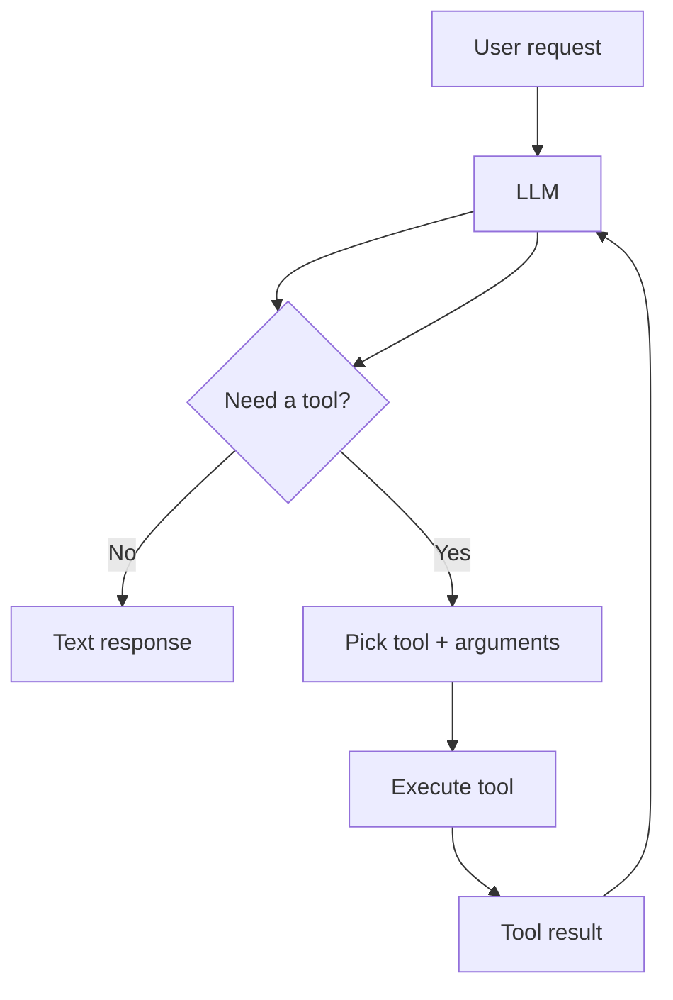

# LLM Tool Orchestration

**LLM tool orchestration** is the practice of getting a language model to **choose, call, and chain the right external capabilities** (APIs, functions, databases, scripts) in the right order to complete a task — instead of answering from text alone.

Think of the LLM as a **planner and coordinator**, and tools as **hands** it can use.

---

## Plain-language version

When you ask an AI assistant to "create a level with three spawn points and export it," the model typically cannot do that by generating prose alone. It needs to:

1. **Understand** what you want
2. **Decide** which tools apply (`create_level`, `add_spawn_point`, `export_level`)
3. **Call** them with valid arguments
4. **Read** the results (success, errors, IDs)
5. **Continue or retry** until the job is done

Orchestrating that loop reliably — especially in production — is **LLM tool orchestration**.

---

## How it works (typical flow)

The "orchestration" part is everything around that loop:

- **Which tools exist** and how they're described to the model
- **In what order** they're allowed or encouraged to run
- **What constraints** apply (validation, permissions, max steps)
- **What happens on failure** (retry, alternate tool, ask user)
- **How instructions are structured** so behavior is repeatable

---

## What counts as a "tool"?

Anything the model can invoke through a structured interface, for example:

- Run a database query
- Search documentation (RAG retrieval)
- Call a game engine command
- Read/write a file
- Hit a REST API
- Execute a script

Each tool is usually defined with a **schema**: name, description, parameters, and types — so the model outputs structured JSON rather than free-form guesses.

---

## How this maps to PlaySide work

From production experience at PlaySide, this work takes the form of:

- **Skill files** — instructions that tell the model *which engine tools to use, in what order, with what constraints*
- **Modular architecture** — codebase shaped so the assistant can safely extend/modify it via those tools
- **Iteration when behavior misses** — tuning the orchestration (tool specs, ordering, guardrails), not just rewriting one prompt

**Production LLM tool orchestration experience** means: shipping systems where the model **reliably drives real software tools** to accomplish workflows — not just chat.

---

## Tool orchestration vs related terms

| Term | What it emphasizes |
|------|---------------------|
| **Prompt engineering** | Wording/instructions to the model |
| **RAG** | Retrieving documents, then answering |
| **Agents** | Broader autonomous loop (plan → act → observe → repeat) |
| **Tool orchestration** | The **wiring and control** of tool selection, sequencing, schemas, and failure handling |

Agents often *use* tool orchestration. RAG is often *one tool* in the set (`search_docs`). Prompt engineering is *one lever* among many.

---

## Why companies care about it

Chat-only LLMs break down on real tasks because they can't act on systems. Tool orchestration turns an LLM into a **product interface** over your software.

The hard part in production isn't "can the model call a function once?" — it's:

- Consistent multi-step workflows
- Valid arguments every time
- Safe permissions
- Recovering from tool errors
- Keeping behavior stable as the codebase changes

That's engineering work, which is why it fits an **AI Engineer** profile.

---

## Example workflow

**User:** "Summarize last week's failed VR sessions for build 42."

**Orchestration might look like:**

1. `get_build_id("42")`
2. `query_telemetry(build_id, status="failed", range="7d")`
3. `aggregate_by_error_type(results)`
4. LLM synthesizes a human-readable summary from structured results

The LLM didn't invent the data — it **directed the pipeline**.

---

## One-line definition

> LLM tool orchestration is designing and operating the system that lets an LLM **reliably invoke and coordinate external tools** to complete tasks in production.

---

## Resume / interview language

When describing this experience, useful phrases include:

- "Production LLM agent workflows with structured tool use"
- "Designed modular skill/instruction files for repeatable tool orchestration"
- "Iterated tool specs, ordering, and constraints from real failure modes"
- "Architecture for AI-modifiable codebases with clear module boundaries"

Typical interview prompt: *"Design an agent that can help users accomplish X over your internal systems"* — answer with tool schemas, sequencing, validation, error handling, evals, and observability.

---

*Reference note — saved for AI Engineer job search planning.*
